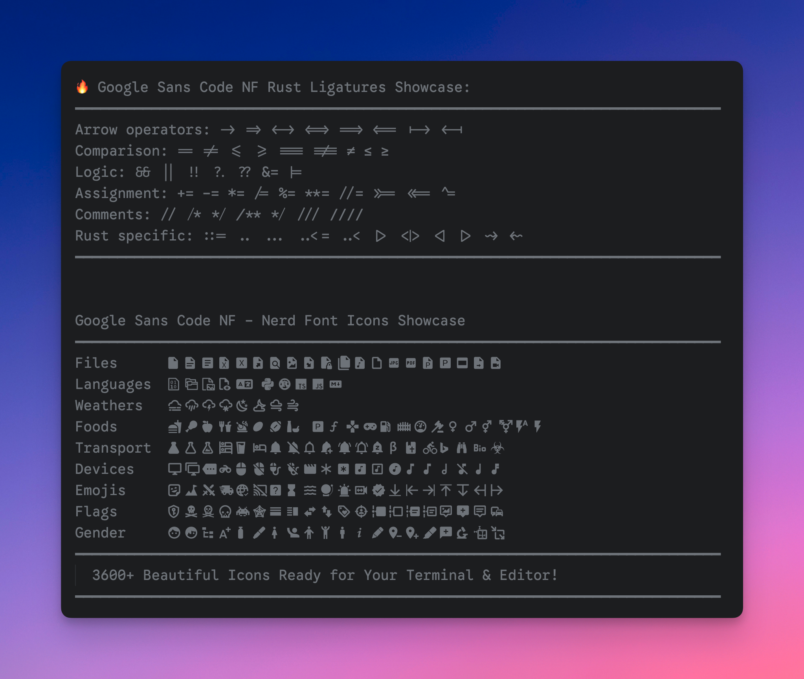
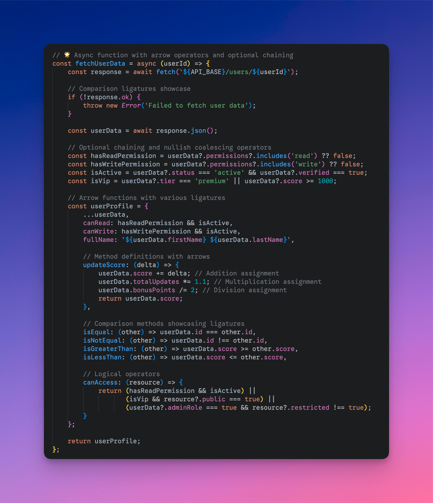

# Google Sans Code Nerd Font

**English** | [中文](README_zh.md)

**Google Sans Code NF** - A feature-complete programming font based on Google Sans Code, enhanced with **programming ligatures** and **Nerd Font icon support**.

## 📖 About

Google Sans Code is an excellent programming font from Google, but there's no official version with programming ligatures and Nerd Font icons. This project combines:

1. **Programming Ligatures** from [Fira Code](https://github.com/tonsky/FiraCode) using [Ligaturizer](https://github.com/ToxicFrog/ligaturizer)
2. **3600+ Programming Icons** using the official [Nerd Font patcher](https://github.com/ryanoasis/nerd-fonts)

The result is a feature-complete programming font with:

**Programming Ligatures:**
- ➤ Arrow operators: `->`, `=>`, `<->`, `<=>`, `==>`, `<==`
- ⚖️ Comparison operators: `==`, `!=`, `<=`, `>=`, `===`, `!==`
- 🔗 Logic operators: `&&`, `||`, `!!`, `?.`, `??`
- ➕ Math operators: `+=`, `-=`, `*=`, `/=`, `%=`
- 📝 Comment styles: `/*`, `*/`, `/**`, `*/`, `///`

**Programming Icons:**
- 🎯 Font Awesome  
- 📦 Material Design Icons  
- 🐙 Octicons (GitHub)
- ⚡ Powerline Symbols
- 🔧 Devicons
- 🌤️ Weather Icons
- 📋 Codicons (VS Code)
- 🔌 IEC Power Symbols
- 💎 Pomicons
- 🐧 Font Logos

## ✨ Font Features Preview



*Google Sans Code NF showcases both programming ligatures and comprehensive Nerd Font icon support*


**See the difference ligatures make in your TypeScript code:**

<table>
<tr>
<td width="50%"><strong>Without Ligatures</strong></td>
<td width="50%"><strong>With Ligatures</strong></td>
</tr>
<tr>
<td></td>
<td></td>
</tr>
</table>

*Ligatures make code more readable by connecting related operators into meaningful symbols*


## 🚀 Quick Start

### Method 1: Homebrew (macOS) - Coming soon!

```bash
# Official Homebrew cask-fonts (coming soon)
# brew install font-google-sans-code-nerd

# Alternative: Direct cask installation (coming soon)
# brew install --cask google-sans-code-nerd-font
```

### Method 2: Download Pre-built Fonts

1. Visit the [Releases](https://github.com/wylu1037/google-sans-code-nerd-font/releases/tag/v1.0.0) page
2. Download `GoogleSansCodeNerdFont.zip`
3. Extract and install font files


## 📁 Project Structure

```
├── data/
│   └── google-sans-code/          # Original Google Sans Code font files
│       ├── static/                # Static font files (TTF)
│       ├── GoogleSansCode-*.ttf   # Variable font files
│       └── OFL.txt               # Open Font License
├── .github/
│   └── workflows/
│       └── build-fonts.yml       # GitHub Actions auto-build config
├── test-build.sh                 # Local test build script
└── README.md
```

## 🤖 Automated Build

This project uses GitHub Actions to automatically build fonts:

- **Trigger**: Push to main branch or manual trigger
- **Environment**: Ubuntu Latest + Docker  
- **Process**: All static font files (12 weights)
- **Output**: TTF format with complete Nerd Font icon set
- **Artifacts**: 90-day retention with all built fonts and release packages

### 🐳 Docker Solution

To solve compatibility issues with `python3-fontforge` in Ubuntu 24.04, we adopted a Docker containerized solution:

- Uses official `nerdfonts/patcher:latest` Docker image
- Avoids FontForge Python binding version conflicts
- Ensures build environment consistency and reliability
- Supports complete `--complete` parameter with all icon sets

### Build Process

1. **Environment Setup**: Install Docker and pull Nerd Font Patcher image
2. **Font Processing**: Use containerized Font Patcher to batch process fonts
3. **Verification**: Ensure generated font file integrity
4. **Package Upload**: Create release package and upload Artifacts

## 💡 Font Features

### Supported Weights

- **Light** (300) + Italic
- **Regular** (400) + Italic  
- **Medium** (500) + Italic
- **SemiBold** (600) + Italic
- **Bold** (700) + Italic
- **ExtraBold** (800) + Italic

### Icon Support

- ✅ 3600+ programming-related icons
- ✅ Complete Powerline support
- ✅ Perfect terminal and editor compatibility
- ✅ Maintains excellent readability of original font

### Ligature Support

- ✅ 150+ programming ligatures from Fira Code
- ✅ Arrow operators, comparison operators, and logic symbols
- ✅ Automatic activation in supported editors
- ✅ Preserves original font spacing and readability

## 🛠️ Usage Instructions

### Terminal Configuration

After installing the fonts, set the font family in your terminal to:
- **Font Name**: `Google Sans Code NF`
- **Alternative Name**: `GoogleSansCode Nerd Font`

### Editor Configuration

**VS Code:**
```json
{
  "editor.fontFamily": "Google Sans Code NF",
  "editor.fontLigatures": true
}
```

**Vim/Neovim:**
```vim
set guifont=Google\ Sans\ Code\ NF:h12
```

## 🔧 Troubleshooting

### Font Display Issues

1. **Icons display as squares**: Confirm you installed the Nerd Font version
2. **Font not taking effect**: Restart application or clear font cache
3. **Spacing issues**: Use monospace version (Mono)
4. **Ligatures not working**: Ensure `editor.fontLigatures: true` is set in your editor
5. **Ligatures appear broken**: Verify you're using "Google Sans Code NF" font family name

### Build Issues

1. **FontForge import error**: Confirm python3-fontforge is installed
2. **Out of memory**: Process font files separately, avoid batch processing
3. **Permission issues**: Ensure scripts have execute permissions

## 📄 License

- **Original Font**: Google Sans Code uses [SIL Open Font License 1.1](data/google-sans-code/OFL.txt)
- **Nerd Font Icons**: Respective original licenses
- **Build Scripts**: MIT License

## 🤝 Contributing

Issues and Pull Requests are welcome!

### Contribution Guidelines

1. Fork this repository
2. Create feature branch: `git checkout -b feature/amazing-feature`
3. Commit changes: `git commit -m 'Add amazing feature'`
4. Push branch: `git push origin feature/amazing-feature`
5. Submit Pull Request

## 🔗 Related Links

- [Google Sans Code Official Repository](https://github.com/googlefonts/googlesans-code)
- [Nerd Fonts Project](https://github.com/ryanoasis/nerd-fonts)
- [Font Patcher Documentation](https://github.com/ryanoasis/nerd-fonts#font-patcher)
- [Ligaturizer Project](https://github.com/ToxicFrog/ligaturizer)
- [Fira Code Ligatures](https://github.com/tonsky/FiraCode)

---

## ⭐ Star History

[](https://star-history.com/#your-username/google-sans-code-nerd-font&Date)

---

**⭐ If this project helps you, please give it a Star!**
