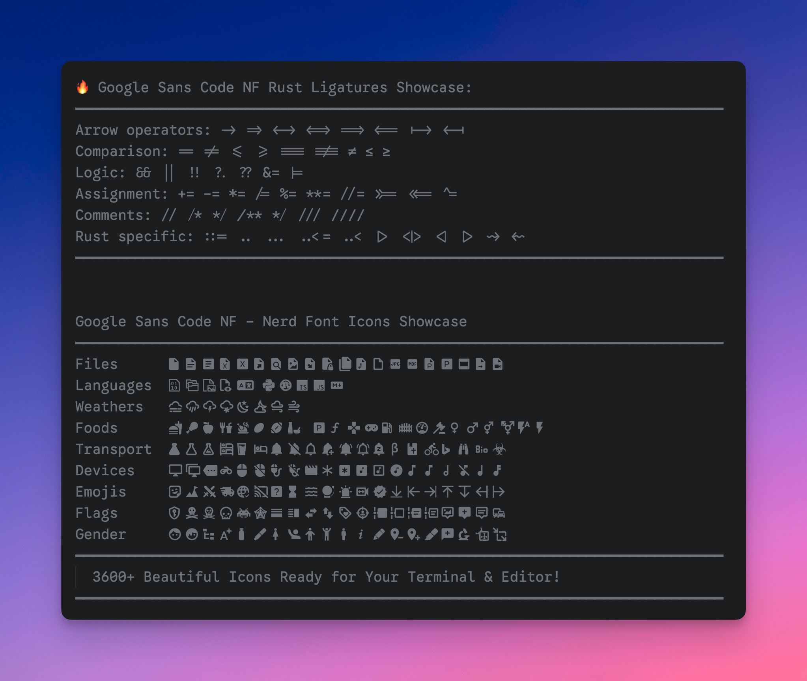
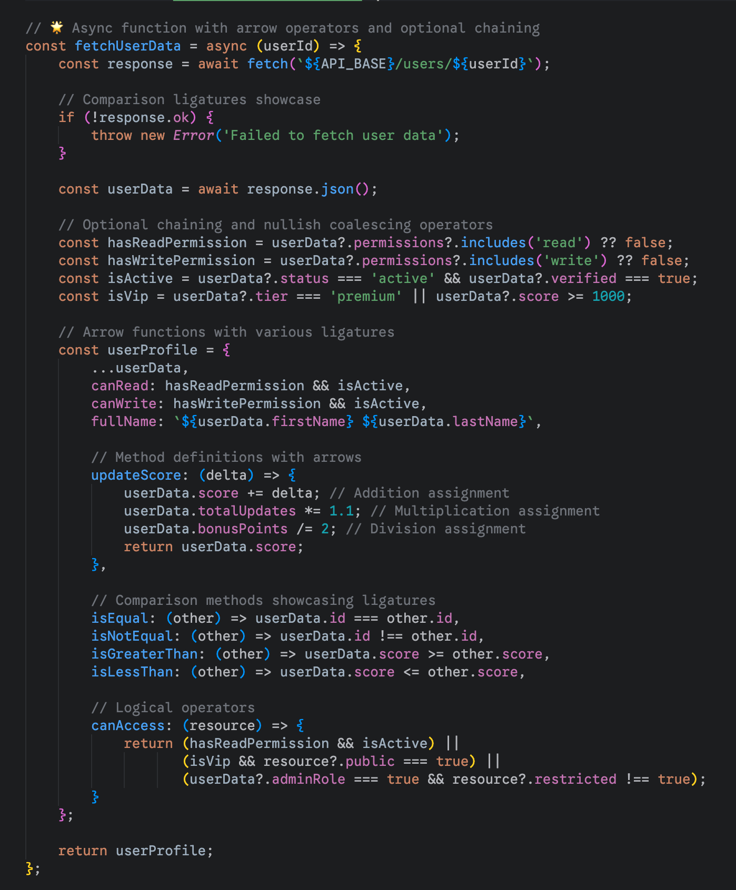
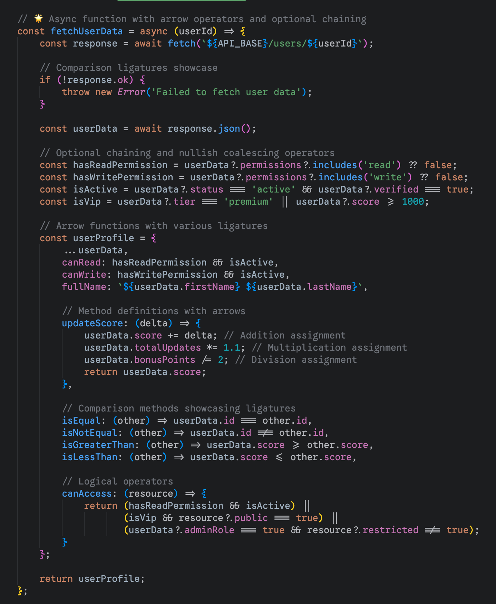

# Google Sans Code Nerd Font

[English](README.md) | **中文**

**Google Sans Code NF** - 基于 Google Sans Code 构建的完整编程字体，支持**编程连字**和**Nerd Font 图标**。

## 📖 关于

Google Sans Code 是 Google 推出的一款优秀的编程字体，但官方没有提供 Nerd Font 版本。本项目使用官方 Nerd Font patcher 为 Google Sans Code 的所有字重添加了 3600+ 个图标，包括：

- 🎯 Font Awesome  
- 📦 Material Design Icons  
- 🐙 Octicons (GitHub)
- ⚡ Powerline Symbols
- 🔧 Devicons
- 🌤️ Weather Icons
- 📋 Codicons (VS Code)
- 🔌 IEC Power Symbols
- 💎 Pomicons
- 🐧 Font Logos

## ✨ 字体特性预览



*Google Sans Code NF 同时支持编程连字和全面的 Nerd Font 图标*


**看看连字功能为你的 TypeScript 代码带来的改变：**

<table>
<tr>
<td width="50%"><strong>不支持连字</strong></td>
<td width="50%"><strong>支持连字</strong></td>
</tr>
<tr>
<td></td>
<td></td>
</tr>
</table>

*连字功能通过将相关操作符连接成有意义的符号，让代码更加易读*

## 🚀 快速开始

### 方法1：Homebrew（macOS）- 即将支持！

```bash
# 官方 Homebrew cask-fonts（即将支持）
# brew install font-google-sans-code-nerd

# 备选：直接 cask 安装（即将支持）
# brew install --cask google-sans-code-nerd-font
```

### 方法2：下载预构建字体

1. 访问 [Releases](https://github.com/wylu1037/google-sans-code-nerd-font/releases/tag/v1.0.0) 页面
2. 下载 `GoogleSansCodeNerdFont.zip`
3. 解压并安装字体文件

## 🛠️ 使用说明

### 终端配置

安装字体后，在终端中设置字体族为：`Google Sans Code NF`

### 编辑器配置

**VS Code:**
```json
{
  "editor.fontFamily": "Google Sans Code NF",
  "editor.fontLigatures": true
}
```

**Vim/Neovim:**
```vim
set guifont=Google\ Sans\ Code\ NF:h12
```

## 🤝 贡献

欢迎提交 Issue 和 Pull Request！

### 贡献指南

1. Fork 此仓库
2. 创建功能分支: `git checkout -b feature/amazing-feature`
3. 提交更改: `git commit -m 'Add amazing feature'`
4. 推送分支: `git push origin feature/amazing-feature`
5. 提交 Pull Request

## 🔗 相关链接

- [Google Sans Code 官方仓库](https://github.com/googlefonts/googlesans-code)
- [Nerd Fonts 项目](https://github.com/ryanoasis/nerd-fonts)
- [Font Patcher 文档](https://github.com/ryanoasis/nerd-fonts#font-patcher)

---

## ⭐ Star 历史

[](https://star-history.com/#your-username/google-sans-code-nerd-font&Date)

---

**⭐ 如果这个项目帮助到你，请给个 Star！**